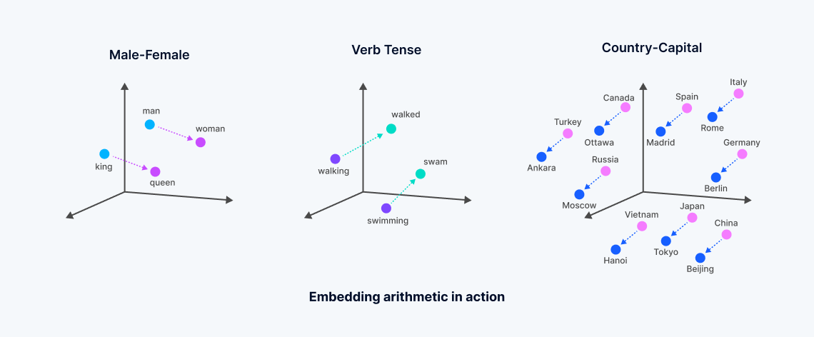

# 12.RAG_against_the_machine

## Description

## Instructions

## Resources
- Fire doc: https://python-fire.readthedocs.io/en/latest/
- Langchain doc: https://reference.langchain.com/python/langchain-text-splitters
- Pydantic doc: https://pydantic.dev/docs/validation/latest/get-started
- Pathlib (rglob): https://docs.python.org/3/library/pathlib.html
- bm25s doc: https://bm25s.github.io/
- tqdm doc: https://tqdm.github.io/
- dspy doc: 
- ollama doc:
- chromadb: https://docs.trychroma.com/docs
- Vector embeddings are numerical representations derived from machine learning models, encapsulating the semantic meaning of unstructured data: https://milvus.io/intro

- transformers
- dspy
- tqdm
- chromadb
- Qwen/Qwen3-0.6B
- asv
- dspy -> cache

## Brouillon
- ouvrir les fichiers selon si c'est des fichiers python ou de la doc
- chuncker
- indexer
- trier selon la pertinence
- Retrieval-Augmented Generation (RAG) system
- comment fonctionne bm25s ? TD-IDF, Saturation du TF, Normalisation par la longueur des documents

Ce qu’il reprend de TF-IDF
TF (term frequency) : plus un mot apparaît dans un document, plus il compte
IDF (inverse document frequency) : un mot rare dans le corpus est plus important qu’un mot très fréquent
Ce que BM25 change par rapport à TF-IDF

BM25 ajoute deux idées importantes :

1) Saturation du TF

Dans TF-IDF, si un mot apparaît 50 fois, il devient 50× plus important (linéaire).

BM25 corrige ça :

au début, chaque occurrence aide beaucoup
puis ça “plafonne” (diminishing returns)

intuition : répéter 100 fois “chat” n’aide pas 100× plus.

2) Normalisation par la longueur des documents

Un long document a naturellement plus de mots.
uv run ollama run qwen
BM25 corrige ça :

un mot dans un petit document “pèse” plus
un mot dans un long document est pénalisé

Cosine similarity (la plus courante)
Elle regarde l’angle entre deux vecteurs : 
- si les vecteurs pointent dans la même direction → très similaires
- si ils sont orthogonaux → pas liés
- si ils sont opposés → très différent

1. Ingest the vLLM repository (provided as attachment) and create a searchable
knowledge base
2. Search this knowledge base to find relevant code snippets and documentation for
given questions
3. Answer questions using an LLM (Qwen/Qwen3-0.6B) with the retrieved context
4. Evaluate your retrieval system’s quality using recall@k metrics

[ ] tester avec chunk_size petit pour voir qu'il n'y est pas de probleme avec le chunk size overlap * 0.05
[ ] pas sur du \n\n pour le separateur
[ ] peut etre refactore le code de index pour transformer en 4 classes, une pour la liste de fichier, une pour le open, une pour chunk et une pour l'indexage
[ ] choix de OSError pour les erreurs d'ouverture de fichiers

make install
make index
make search_dataset
make answer_dataset
make evaluate

[ ] search -> open file -> add to json file output in one time
[ ] revoir toute la gestion des erreurs
[ ] retirer les type ignore
[ ] est ce que j'ai besoin de tensorflow que j ai rajoute a la main
[ ] rajouter encoding="utf-8" sur toutes les ouvertures de fichiers json txt py mduv run ollama run qwen
[ ] ajouter dans les depedances systeme du projet ollama a avoir avec uv

choisir le bon modele d'embedding : comment savoir quoi choisir comme modele pour de l embedding : self._embedding_function: Callable = OllamaEmbeddingFunction(model_name=)
https://ollama.com/library

on fait des paquets de chunk pour accelerer l embedding car il y a des limites du nombre de requetes http

generation a l ia: embedding et embed batch

parametre sur lesquels on peut jouer:
taille des chunks, overlaping,  nombre de chunks pris en contexte, model utilise pour l'embedding, hybrid normaliser les vecteurs entre bm25 et chromadb au lieu de rrf, nombre de fois ou le path ou le file est noté en contexte,

completer .PHONY

Dans le Reciprocal Rank Fusion (RRF), le k est un paramètre de lissage qui contrôle l’importance du rang dans le score.

ia used for improving prompt for query expansion

implement possibility with vllm local
implement recall for make evaluate comparision between file given by 
recall superior to 95% on doc and 70% on code